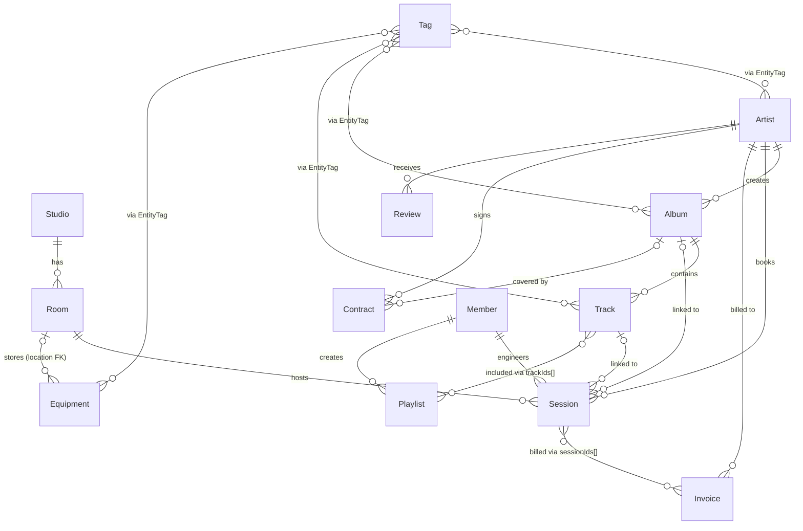

# SoundDesk — Database (localStorage)

## 엔티티 관계도 (ERD)



---

## 엔티티별 필드 정의

### Studio
| 필드 | 타입 | 설명 |
|------|------|------|
| id | string | UUID |
| name | string | 스튜디오명 |
| description | string | 설명 |
| address | string | 주소 |
| phone | string | 전화번호 |
| email | string | 이메일 |
| openTime | string | 운영 시작 시간 (HH:mm) |
| closeTime | string | 운영 종료 시간 (HH:mm) |
| createdAt | string | ISO 날짜 문자열 |
| updatedAt | string | ISO 날짜 문자열 |

> **특이사항:** 단일 객체 저장 (배열 아님)

### Room
| 필드 | 타입 | 설명 |
|------|------|------|
| id | string | UUID |
| studioId | string | FK → Studio.id |
| name | string | 룸명 |
| type | `'recording'｜'mixing'｜'mastering'｜'rehearsal'` | 룸 타입 |
| hourlyRate | number | 시간당 요금 |
| capacity | number | 수용 인원 |
| equipment | string | JSON 배열 문자열 (Equipment.id 목록) |
| isAvailable | boolean | 예약 가능 여부 |
| createdAt | string | |
| updatedAt | string | |

### Artist
| 필드 | 타입 | 설명 |
|------|------|------|
| id | string | UUID |
| name | string | 활동명 |
| email | string | |
| phone | string | |
| genre | string | 장르 |
| label | string | 소속 레이블 |
| bio | string | 소개글 |
| avatar | string | 이미지 URL (nullable) |
| createdAt | string | |
| updatedAt | string | |

### Album
| 필드 | 타입 | 설명 |
|------|------|------|
| id | string | UUID |
| artistId | string | FK → Artist.id |
| title | string | 앨범 제목 |
| genre | string | 장르 |
| releaseDate | string ｜ null | YYYY-MM-DD |
| status | `'planning'｜'recording'｜'mixing'｜'mastering'｜'released'` | |
| coverArt | string ｜ null | 커버 이미지 URL |
| totalTracks | number | 트랙 수 |
| createdAt | string | |
| updatedAt | string | |

### Track
| 필드 | 타입 | 설명 |
|------|------|------|
| id | string | UUID |
| albumId | string | FK → Album.id |
| title | string | 트랙 제목 |
| duration | number | 길이 (초) |
| trackNumber | number | 트랙 번호 |
| status | `'pending'｜'recording'｜'recorded'｜'mixing'｜'mixed'｜'mastered'｜'final'` | |
| bpm | number ｜ null | BPM |
| key | string ｜ null | 음악 키 |
| notes | string | 메모 |
| createdAt | string | |
| updatedAt | string | |

### Session
| 필드 | 타입 | 설명 |
|------|------|------|
| id | string | UUID |
| roomId | string | FK → Room.id |
| artistId | string | FK → Artist.id |
| albumId | string ｜ null | FK → Album.id |
| trackId | string ｜ null | FK → Track.id |
| engineerId | string | FK → Member.id |
| date | string | YYYY-MM-DD |
| startTime | string | HH:mm |
| endTime | string | HH:mm |
| status | `'scheduled'｜'in-progress'｜'completed'｜'cancelled'` | |
| notes | string | 메모 |
| createdAt | string | |
| updatedAt | string | |

### Equipment
| 필드 | 타입 | 설명 |
|------|------|------|
| id | string | UUID |
| name | string | 장비명 |
| category | `'microphone'｜'headphone'｜'monitor'｜'mixer'｜'interface'｜'instrument'｜'cable'｜'other'` | |
| brand | string | 브랜드 |
| model | string | 모델명 |
| serialNumber | string | 시리얼 번호 |
| purchaseDate | string | YYYY-MM-DD |
| purchasePrice | number | 구입가 |
| condition | `'excellent'｜'good'｜'fair'｜'poor'` | |
| location | string ｜ null | FK → Room.id |
| isAvailable | boolean | |
| createdAt | string | |
| updatedAt | string | |

### Member (스태프)
| 필드 | 타입 | 설명 |
|------|------|------|
| id | string | UUID |
| name | string | |
| email | string | |
| phone | string | |
| role | `'owner'｜'engineer'｜'assistant'｜'intern'` | |
| speciality | `'recording'｜'mixing'｜'mastering'｜'general'` | |
| hourlyRate | number | 시간당 인건비 |
| avatar | string ｜ null | |
| createdAt | string | |
| updatedAt | string | |

### Invoice
| 필드 | 타입 | 설명 |
|------|------|------|
| id | string | UUID |
| artistId | string | FK → Artist.id |
| sessionIds | string | JSON 배열 문자열 (Session.id 목록) |
| items | string | JSON 배열 문자열 `[{label, amount}]` |
| subtotal | number | |
| tax | number | |
| total | number | |
| currency | `'KRW'｜'USD'` | |
| status | `'draft'｜'sent'｜'paid'｜'overdue'｜'cancelled'` | |
| dueDate | string | YYYY-MM-DD |
| paidDate | string ｜ null | YYYY-MM-DD |
| notes | string | |
| createdAt | string | |
| updatedAt | string | |

### Contract
| 필드 | 타입 | 설명 |
|------|------|------|
| id | string | UUID |
| artistId | string | FK → Artist.id |
| albumId | string ｜ null | FK → Album.id |
| type | `'session'｜'album'｜'retainer'` | |
| startDate | string | YYYY-MM-DD |
| endDate | string | YYYY-MM-DD |
| totalValue | number | 계약 총액 |
| terms | string | 계약 조건 (자유 텍스트) |
| status | `'draft'｜'active'｜'completed'｜'terminated'` | |
| signedDate | string ｜ null | YYYY-MM-DD |
| createdAt | string | |
| updatedAt | string | |

### Playlist
| 필드 | 타입 | 설명 |
|------|------|------|
| id | string | UUID |
| name | string | |
| description | string | |
| trackIds | string | JSON 배열 문자열 (순서 있는 Track.id 목록) |
| isPublic | boolean | |
| createdBy | string | FK → Member.id |
| createdAt | string | |
| updatedAt | string | |

### Review
| 필드 | 타입 | 설명 |
|------|------|------|
| id | string | UUID |
| artistId | string | FK → Artist.id |
| sessionId | string ｜ null | FK → Session.id |
| rating | number | 1 ~ 5 |
| comment | string | |
| createdAt | string | |

### Tag
| 필드 | 타입 | 설명 |
|------|------|------|
| id | string | UUID |
| name | string | 태그명 |
| color | string | HEX 색상 (#RRGGBB) |
| createdAt | string | |

### EntityTag (N:M 연결 테이블)
| 필드 | 타입 | 설명 |
|------|------|------|
| id | string | UUID |
| entityType | `'artist'｜'album'｜'track'｜'equipment'` | |
| entityId | string | 해당 엔티티의 id |
| tagId | string | FK → Tag.id |

---

## localStorage 키 네이밍 규칙

| 키 | 저장 형태 | 엔티티 |
|----|-----------|--------|
| `sounddesk_studio` | 단일 객체 (JSON object) | Studio |
| `sounddesk_rooms` | JSON 배열 | Room[] |
| `sounddesk_artists` | JSON 배열 | Artist[] |
| `sounddesk_albums` | JSON 배열 | Album[] |
| `sounddesk_tracks` | JSON 배열 | Track[] |
| `sounddesk_sessions` | JSON 배열 | Session[] |
| `sounddesk_equipment` | JSON 배열 | Equipment[] |
| `sounddesk_members` | JSON 배열 | Member[] |
| `sounddesk_invoices` | JSON 배열 | Invoice[] |
| `sounddesk_contracts` | JSON 배열 | Contract[] |
| `sounddesk_playlists` | JSON 배열 | Playlist[] |
| `sounddesk_reviews` | JSON 배열 | Review[] |
| `sounddesk_tags` | JSON 배열 | Tag[] |
| `sounddesk_entity_tags` | JSON 배열 | EntityTag[] |
| `sounddesk_settings` | 단일 객체 | `{ defaultCurrency, taxRate, darkMode }` |

---

## 관계 처리 방식

### 1:N 관계 (FK 저장)
```
Album.artistId = "uuid-artist-001"
→ 조회 시: artistService.getArtistById(album.artistId)
```

### N:M 관계 (JSON 배열 문자열)
```
Invoice.sessionIds = '["uuid-sess-001","uuid-sess-002"]'
→ 파싱: JSON.parse(invoice.sessionIds) as string[]
→ 조회: ids.map(id => sessionService.getSessionById(id))

Playlist.trackIds = '["uuid-track-003","uuid-track-001"]'
→ 순서 보존, 파싱 후 순서대로 렌더링
```

### 폴리모픽 N:M (EntityTag)
```
EntityTag { entityType: 'album', entityId: 'uuid-album-001', tagId: 'uuid-tag-007' }
→ 특정 앨범의 태그 조회:
   tagService.getTagsForEntity('album', albumId)
   = getAll('sounddesk_entity_tags')
     .filter(et => et.entityType === 'album' && et.entityId === albumId)
     .map(et => tagService.getTagById(et.tagId))
```

### 종속 삭제 (Cascade) 규칙
- Room 삭제 → 해당 Room의 Session 상태를 'cancelled'로 변경 (삭제 아님)
- Artist 삭제 → 관련 Album, Session, Invoice, Contract, Review 조회 불가 (고아 데이터 허용)
- Album 삭제 → 해당 Album의 Track 삭제
- Track 삭제 → Playlist.trackIds에서 해당 id 제거

> **설계 원칙:** localStorage 앱 특성상 완전한 cascade 미구현. 삭제 시 연결 데이터는 orphan 허용하되, 표시 시 null 체크로 방어.

### 세션 충돌 검사 로직
```
충돌 조건:
  같은 roomId + 같은 date + 시간 겹침
  시간 겹침 = startA < endB AND endA > startB
  (HH:mm 문자열 비교 가능 — 같은 날짜 기준)
```
